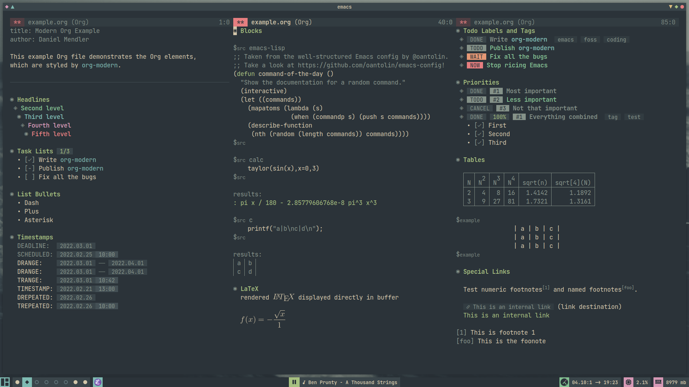

# emacs

my emacs configuration  
thanks to [nano-theme](https://github.com/rougier/nano-theme) and [nano-modeline](https://github.com/rougier/nano-modeline) for making minimal emacs theming easy

## screenshots

