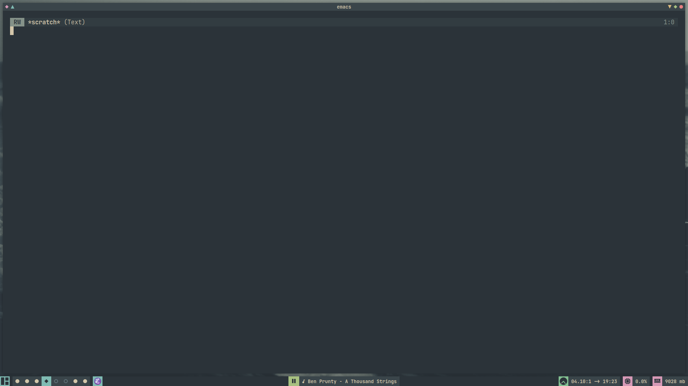
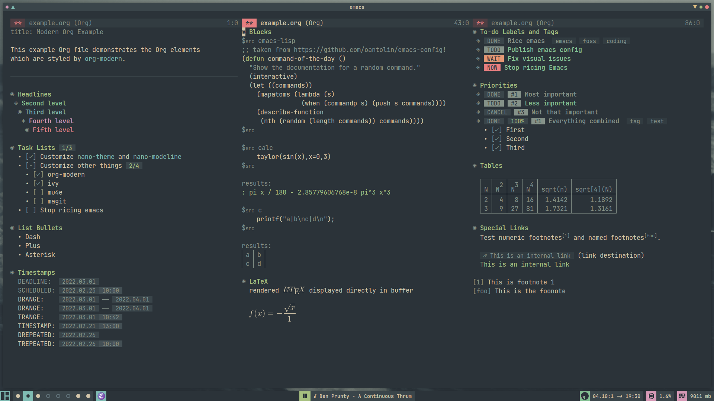

# emacs

my emacs configuration  
thanks to [nano-theme](https://github.com/rougier/nano-theme) and [nano-modeline](https://github.com/rougier/nano-modeline) for making minimal emacs theming so much easier

## install

- `git clone https://github.com/Apeiros-46B/emacs ~/.emacs.d`
- launch emacs
- wait for the `straight.el` bootstrap and package install (loading is a blank screen for aesthetic reasons)
- (optional) [add `org-protocol` bookmarklets in your browser](org_protocol.md)

## screenshots

## packages

- `straight`
- `use-package`
- `general`
- `nano-theme`
- `nano-modeline`
- `evil`
  - `goto-chg`
  - `evil-numbers`
  - `evil-surround`
  - `evil-org`
- `ivy`
  - `counsel`
- `smex`
- `org`
  - `org-protocol`
  - `org-roam`
  - `org-roam-ui`
  - `org-modern`
  - `org-appear`
  - `org-fragtog`
  - `org-tree-slide`
  - `org-download`
