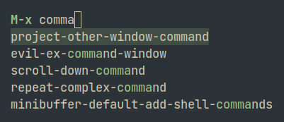

# emacs

my emacs configuration  
thanks to [nano-theme](https://github.com/rougier/nano-theme) and [nano-modeline](https://github.com/rougier/nano-modeline) for making minimal emacs theming so much easier

## screenshots

## install

`git clone https://github.com/Apeiros-46B/emacs ~/.emacs.d`

## packages

- straight
- use-package
- general
- nano-theme
- nano-modeline
- evil
  - goto-chg
  - evil-numbers
  - evil-surround
  - evil-org
- hop
- counsel
- ivy
- smex
- org
- org-roam
- org-modern
